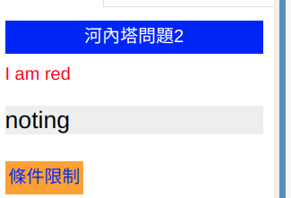
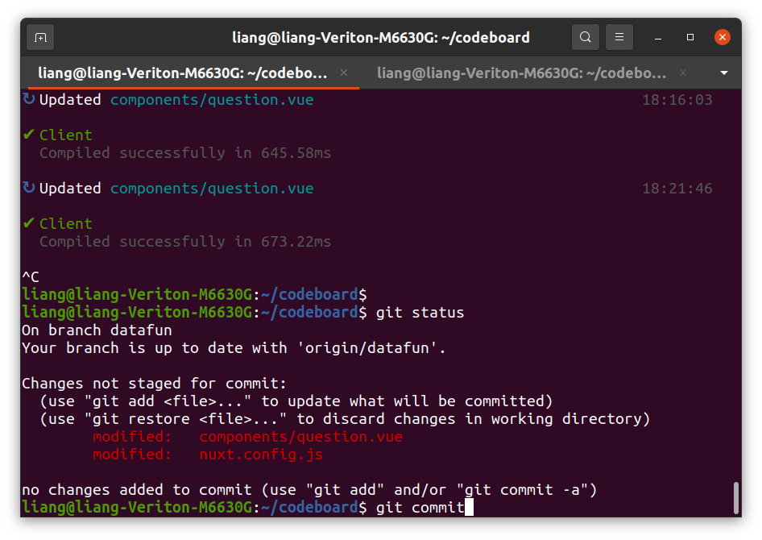
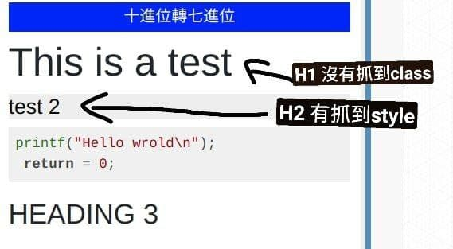

# 讓question元件吃markdown語法
## 預計目標
1. - [x] 問題說明改成markdown格式
2. - [ ] 標題＃指定成特定格式
     - [x] 用<h1 style="color:black; background:#eeeeee; font-size:16pt;">指定格式
     - [x] 用<h1 class="pseg">指定格式
3. - [ ] 寫文件
4. - [x]  如何給markdown正確的字串

# 2021/01/25
## 問題說明改成markdown格式
###  安裝@nuxtjs/markdownit
```javascript
npm install markdown-it --save
```
### 安裝@markdown-it-highlight
這個裝完跳error
```javascript
npm install markdown-it-hightlight --save
```
這個OK
```javascript
npm install --save markdown-it-highlightjs
```

### nuxt.config.js   補上 modules
```javascript
  modules: [
    "@nuxtjs/markdownit",
  ],

  markdownit: {
    injected: true,
    use: [
      'markdown-it-highlightjs'
    ]
  },
```
# 2021/01/26
## 如何給markdown正確的字串?

 * 使用兩個換行符號當每一個tag的結尾
 * 只用一個換行符號，如果給html語法，會有bug，無法抓到下一個tag。
 * bug:太長的英文(數字)字串，字彙被吃掉，無法自動換行，也沒有捲動棒可以拉。
##    加入html語法修改文字顏色
### nuxt.config.js 要設定參數
```javascript
markdownit: {
    injected: true,
    html: true,// 加上這行，讓markdown接受htlm語法
    use: [
      'markdown-it-highlightjs'
    ]
  },
```
 ### 給字串時自己用html語法改文字顏色
 ```javascript
 mdStr :"<font color=red>I am red</font>\n\n## noting"
 ```




## 改markdownit 的設定檔

* 我直接改/home/liang/codeboard/node_modules/markdown-it/lib/rules_block/heading.js
* 但這個檔案好像是自動安裝的。

* 是被git ignore的檔案，git根本沒抓到有修改

  
  
# 2021/01/27

## markdown-it有修改規則的函數

* 本來要參考這個，後來想到this.$md的用法了
  https://engineeringbydoing.com/article/custom-markdown-syntax-vue
* 後來是參考這個改的
  https://github.com/markdown-it/markdown-it/blob/master/docs/architecture.md
* 但無法使用class改文字格式
```javascript
<template>
    <p v-html="$md.render(setMdRule(mdStr))">
    </p>
</template>

<script>
import { mapState } from "vuex";
export default {
    data() {
        return {
            mdStr: '# This is a test\n## test 2\n```c\nprintf("Hello wrold\\n");\n return = 0;\n```\n\n### HEADING 3',
        };
    },
    methods: {

        setMdRule(markdown) {
            // console.log("MMMMMMM", this.$md.parse(markdown));
            this.$md.renderer.rules.heading_open = function(
                tokens,
                idx,
                options,
                env,
                self
            ) {
                if (tokens[idx].tag == "h1") {
                    return '<h1 class="pseg">';
                } else if (tokens[idx].tag == "h2") {
                    return '<h1 style=\"color:black; background:#eeeeee; font-size:16pt;\">';
                } else return "<" + tokens[idx].tag + ">";
            };


            return markdown;
        },
    },
};
</script>
```



# 2021/02/01
## 用class指定格式
* 在定義class的地方，前面加上>>>

 ```css
 <style scoped>
>>> .pseg {
  display: inline-block;
  margin-top: 8px;
  background: orange;
  color: blue;
  padding: 3px;
  /* font-size: 18px; */
}
</style>
 ```
* 把md.rule函數放到mounted
```html
<template>
  <div class="probPanel">
   <div v-html="$md.render(mdStr)"></div>
  </div>
</template>
```

```javascript
<script>
import { mapState } from "vuex";
export default {
  mounted() {
    this.$md.renderer.rules.heading_open = function (
      tokens,
      idx,
      options,
      env,
      self
    ) {
      switch (tokens[idx].tag) {
        case "h1":
          if (idx == 0) return "<p class=ptitle>";
          else return "<p class=pseg>";
          break;
        case "h2":
          return "<p class=psample>";
          break;
        default:
          return "<" + tokens[idx].tag + ">";
      }
    };
    this.$md.renderer.rules.heading_close = function (
      tokens,
      idx,
      options,
      env,
      self
    ) {
      switch (tokens[idx].tag) {
        case "h1":
        case "h2":
          return "</p>";
          break;
        default:
          return "</" + tokens[idx].tag + ">";
      }
    };
  },
  data() {
    return {
      mdStr:
        '# This is a test\n# TEST font size\n\n## 給定 n 及三根柱子代號，你知道第 k 個步驟是從哪裡移動到哪裡嗎？這個問題需要輸入 n, k, 以及出發點、目的地及暫存區的三根柱子代號。\n```c\nprintf("Hello wrold\\n");\n return = 0;\n```\n\n### HEADING 3\n\n # 條件限制\n\n## 時間＜1秒 記憶體＜1M',
      // mdStr :"<font color=red>I am red</font>\n\n## noting"
    };
  },
};
</script>
```
```css
<style scoped>
>>> .ptitle {
  padding: 3px;
  background: blue;
  color: white;
  margin: 12px 0 6px 0;
  text-align: center;
}
>>> .pseg {
  display: inline-block;
  margin-top: 8px;
  background: orange;
  color: blue;
  padding: 3px;
  /* font-size: 18px; */
}
>>> .psample {
  margin: 6px 0;
  width: 100%;
  overflow: auto;
  background: #eeeeee;
  color: black;
  padding: 3px 8px;
  font-family: "Courier New", Courier, monospace;
  /* font-size:16px; */
}

</style>
```

